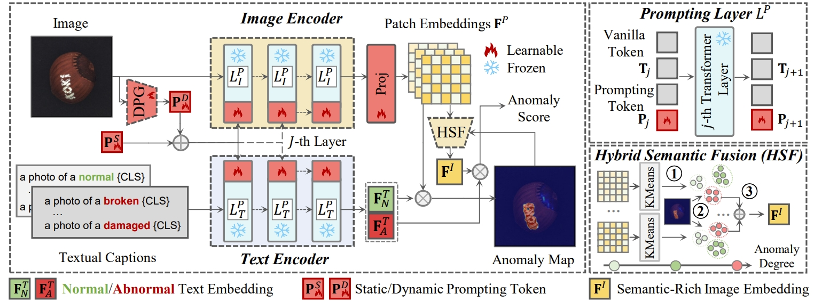
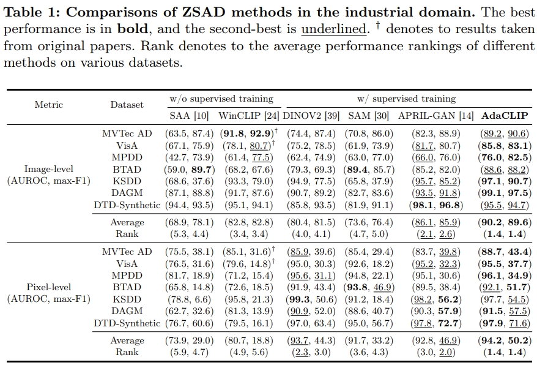
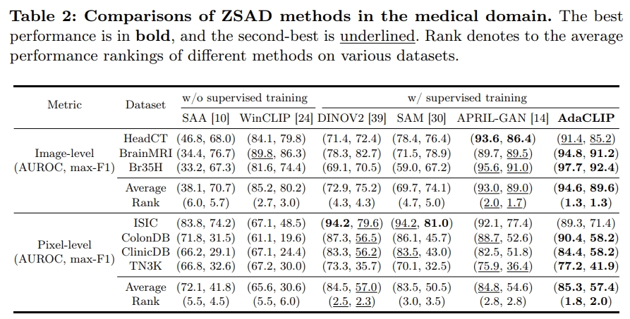
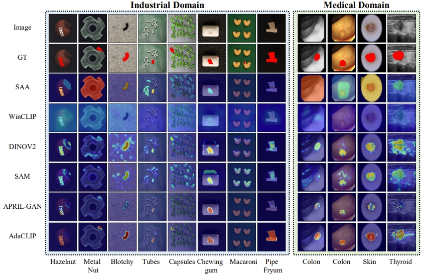
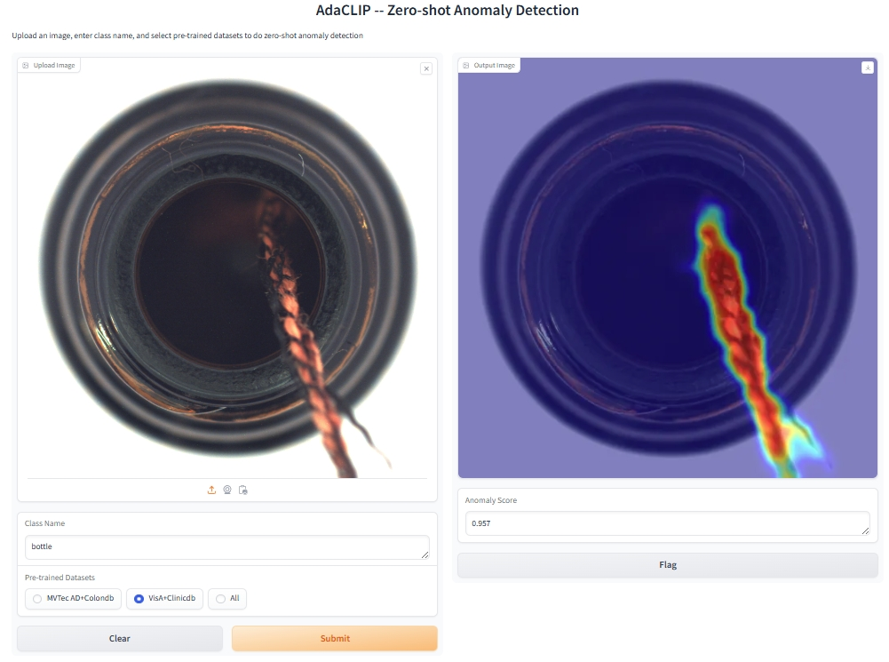

# AdaCLIP (Detecting Anomalies for Novel Categories)
[](https://huggingface.co/spaces/Caoyunkang/AdaCLIP)

> [**ECCV 24**] [**AdaCLIP: Adapting CLIP with Hybrid Learnable Prompts for Zero-Shot Anomaly Detection**](https://arxiv.org/abs/2407.15795).
>
> by [Yunkang Cao](https://caoyunkang.github.io/), [Jiangning Zhang](https://zhangzjn.github.io/),  [Luca Frittoli](https://scholar.google.com/citations?user=cdML_XUAAAAJ), 
> [Yuqi Cheng](https://scholar.google.com/citations?user=02BC-WgAAAAJ&hl=en), [Weiming Shen](https://scholar.google.com/citations?user=FuSHsx4AAAAJ&hl=en), [Giacomo Boracchi](https://boracchi.faculty.polimi.it/) 
> 

## Introduction 
Zero-shot anomaly detection (ZSAD) targets the identification of anomalies within images from arbitrary novel categories. 
This study introduces AdaCLIP for the ZSAD task, leveraging a pre-trained vision-language model (VLM), CLIP. 
AdaCLIP incorporates learnable prompts into CLIP and optimizes them through training on auxiliary annotated anomaly detection data. 
Two types of learnable prompts are proposed: \textit{static} and \textit{dynamic}. Static prompts are shared across all images, serving to preliminarily adapt CLIP for ZSAD. 
In contrast, dynamic prompts are generated for each test image, providing CLIP with dynamic adaptation capabilities. 
The combination of static and dynamic prompts is referred to as hybrid prompts, and yields enhanced ZSAD performance. 
Extensive experiments conducted across 14 real-world anomaly detection datasets from industrial and medical domains indicate that AdaCLIP outperforms other ZSAD methods and can generalize better to different categories and even domains. 
Finally, our analysis highlights the importance of diverse auxiliary data and optimized prompts for enhanced generalization capacity.

## Corrections
- The description to the utilized training set in our paper is not accurate. By default, we utilize MVTec AD & ColonDB for training,
and VisA & ClinicDB are utilized for evaluations on MVTec AD & ColonDB. 

## Overview of AdaCLIP


## 🛠️ Getting Started

### Installation
To set up the AdaCLIP environment, follow one of the methods below:

- Clone this repo:
  ```shell
  git clone https://github.com/caoyunkang/AdaCLIP.git && cd AdaCLIP
  ```
- You can use our provided installation script for an automated setup::
  ```shell
  sh install.sh
  ```
- If you prefer to construct the experimental environment manually, follow these steps:
  ```shell
  conda create -n AdaCLIP python=3.9.5 -y
  conda activate AdaCLIP
  pip install torch==1.10.1+cu111 torchvision==0.11.2+cu111 torchaudio==0.10.1 -f https://download.pytorch.org/whl/cu111/torch_stable.html
  pip install tqdm tensorboard setuptools==58.0.4 opencv-python scikit-image scikit-learn matplotlib seaborn ftfy regex numpy==1.26.4
  pip install gradio # Optional, for app 
  ```
- Remember to update the dataset root in config.py according to your preference:
  ```python
  DATA_ROOT = '../datasets' # Original setting
  ```

### Dataset Preparation 
Please download our processed visual anomaly detection datasets to your `DATA_ROOT` as needed. 

#### Industrial Visual Anomaly Detection Datasets
Note: some links are still in processing...

| Dataset | Google Drive | Baidu Drive | Task
|------------|------------------|------------------| ------------------|
| MVTec AD    | [Google Drive](https://drive.google.com/file/d/12IukAqxOj497J4F0Mel-FvaONM030qwP/view?usp=drive_link) | [Baidu Drive](https://pan.baidu.com/s/1k36IMP4w32hY9BXOUM5ZmA?pwd=kxud) | Anomaly Detection & Localization |
| VisA    | [Google Drive](https://drive.google.com/file/d/1U0MZVro5yGgaHNQ8kWb3U1a0Qlz4HiHI/view?usp=drive_link) | [Baidu Drive](https://pan.baidu.com/s/15CIsP-ulZ1AN0_3quA068w?pwd=lmgc) | Anomaly Detection & Localization |
| MPDD    | [Google Drive](https://drive.google.com/file/d/1cLkZs8pN8onQzfyNskeU_836JLjrtJz1/view?usp=drive_link) | [Baidu Drive](https://pan.baidu.com/s/11T3mkloDCl7Hze5znkXOQA?pwd=4p7m) | Anomaly Detection & Localization | 
| BTAD    | [Google Drive](https://drive.google.com/file/d/19Kd8jJLxZExwiTc9__6_r_jPqkmTXt4h/view?usp=drive_link) | [Baidu Drive](https://pan.baidu.com/s/1f4Tq-EXRz6iAswygH2WbFg?pwd=a60n) | Anomaly Detection & Localization |
| KSDD    | [Google Drive](https://drive.google.com/file/d/13UidsM1taqEAVV_JJTBiCV1D3KUBpmpj/view?usp=drive_link) | [Baidu Drive](https://pan.baidu.com/s/12EaOdkSbdK85WX5ajrfjQw?pwd=6n3z) | Anomaly Detection & Localization |
| DAGM    | [Google Drive](https://drive.google.com/file/d/1f4sm8hpWQRzZMpvM-j7Q3xPG2vtdwvTy/view?usp=drive_link) | [Baidu Drive](https://pan.baidu.com/s/1JpDUJIksD99t003dNF1y9g?pwd=u3aq) | Anomaly Detection & Localization |
| DTD-Synthetic    | [Google Drive](https://drive.google.com/file/d/1em51XXz5_aBNRJlJxxv3-Ed1dO9H3QgS/view?usp=drive_link) | [Baidu Drive](https://pan.baidu.com/s/16FlvIBWtjaDzWxlZfWjNeg?pwd=aq5c) | Anomaly Detection & Localization |


#### Medical Visual Anomaly Detection Datasets
| Dataset | Google Drive | Baidu Drive | Task
|------------|------------------|------------------|  ------------------|
| HeadCT    | [Google Drive](https://drive.google.com/file/d/1ore0yCV31oLwwC--YUuTQfij-f2V32O2/view?usp=drive_link) | [Baidu Drive](https://pan.baidu.com/s/16PfXWJlh6Y9vkecY9IownA?pwd=svsl) | Anomaly Detection |
| BrainMRI    | [Google Drive](https://drive.google.com/file/d/1JLYyzcPG3ULY2J_aw1SY9esNujYm9GKd/view?usp=drive_link) | [Baidu Drive](https://pan.baidu.com/s/1UgGlTR-ABWAEiVUX-QSPhA?pwd=vh9e) | Anomaly Detection |
| Br35H    | [Google Drive](https://drive.google.com/file/d/1qaZ6VJDRk3Ix3oVp3NpFyTsqXLJ_JjQy/view?usp=drive_link) | [Baidu Drive](https://pan.baidu.com/s/1yCS6t3ht6qwJgM06YsU3mg?pwd=ps1e) | Anomaly Detection |
| ISIC    | [Google Drive](https://drive.google.com/file/d/1atZwmnFsz7mCsHWBZ8pkL_-Eul9bKFEx/view?usp=drive_link) | [Baidu Drive](https://pan.baidu.com/s/1Mf0w8RFY9ECZBEoNTyV3ZA?pwd=p954) | Anomaly Localization |
| ColonDB    | [Google Drive](https://drive.google.com/file/d/1tjZ0o5dgzka3wf_p4ErSRJ9fcC-RJK8R/view?usp=drive_link) | [Baidu Drive](https://pan.baidu.com/s/1nJ4L65vfNFGpkK_OJjLoVg?pwd=v8q7) | Anomaly Localization |
| ClinicDB    | [Google Drive](https://drive.google.com/file/d/1ciqZwMs1smSGDlwQ6tsr6YzylrqQBn9n/view?usp=drive_link) | [Baidu Drive](https://pan.baidu.com/s/1TPysfqhA_sXRPLGNwWBX6Q?pwd=3da6) | Anomaly Localization |
| TN3K    | [Google Drive](https://drive.google.com/file/d/1LuKEMhrUGwFBlGCaej46WoooH89V3O8_/view?usp=drive_link) | [Baidu Drive](https://pan.baidu.com/s/1i5jMofCcRFcUdteq8VMEOQ?pwd=aoez) | Anomaly Localization |

#### Custom Datasets
To use your custom dataset, follow these steps:

1. Refer to the instructions in `./data_preprocess` to generate the JSON file for your dataset.
2. Use `./dataset/base_dataset.py` to construct your own dataset.


### Weight Preparation

We offer various pre-trained weights on different auxiliary datasets. 
Please download the pre-trained weights in `./weights`.

| Pre-trained Datasets | Google Drive | Baidu Drive 
|------------|------------------|------------------|  
| MVTec AD & ClinicDB    | [Google Drive](https://drive.google.com/file/d/1xVXANHGuJBRx59rqPRir7iqbkYzq45W0/view?usp=drive_link) | [Baidu Drive](https://pan.baidu.com/s/1K9JhNAmmDt4n5Sqlq4-5hQ?pwd=fks1) | 
| VisA & ColonDB    | [Google Drive](https://drive.google.com/file/d/1QGmPB0ByPZQ7FucvGODMSz7r5Ke5wx9W/view?usp=drive_link) | [Baidu Drive](https://pan.baidu.com/s/1GmRCylpboPseT9lguCO9nw?pwd=fvvf) | 
| All Datasets Mentioned Above   | [Google Drive](https://drive.google.com/file/d/1Cgkfx3GAaSYnXPLolx-P7pFqYV0IVzZF/view?usp=drive_link) | [Baidu Drive](https://pan.baidu.com/s/1J4aFAOhUbeYOBfZFbkOixA?pwd=0ts3) |


### Train

By default, we use MVTec AD & Colondb for training and VisA for validation:
```shell
CUDA_VISIBLE_DEVICES=0 python train.py --save_fig True --training_data mvtec colondb --testing_data visa
```


Alternatively, for evaluation on MVTec AD & Colondb, we use VisA & ClinicDB for training and MVTec AD for validation.
```shell
CUDA_VISIBLE_DEVICES=0 python train.py --save_fig True --training_data visa clinicdb --testing_data mvtec
```
Since we have utilized half-precision (FP16) for training, the training process can occasionally be unstable.
It is recommended to run the training process multiple times and choose the best model based on performance
on the validation set as the final model.

### Shared gate experiment

#### Source classification/localization loss diagnosis (no training)

Compare the existing training objective on **MVTec + ColonDB source data**, not
VisA. This is a small paired diagnostic before deciding whether gate supervision
is useful, not a weight sweep on the target dataset:

```bash
python test.py --fusion_mode shared_gate --load_baseline --diagnose_source_losses \
  --ckt_path ./workspaces/baseline_111/models/0s-pretrained-mvtec-colondb-ViT-L-14-336-SD-VL-D4-L5-HSF-K20-Fadd-W0-S111_epoch_5.pth \
  --source_data mvtec colondb --source_samples_per_group 2 --source_sample_seed 111 \
  --save_path ./workspaces/baseline_111_source_loss_diag
```

Runtime files to sync: `test.py`, `method/trainer.py`, and the new
`tools/source_loss_diagnostics.py` (which also imports the existing
`tools/gate_equivalence.py`). Source mode returns before target loading;
`--testing_data` is ignored even if the ordinary default `visa` appears in the
argument log. The source options deliberately only allow `mvtec` and `colondb`.

The sampler uses a local seeded RNG, selecting at most two images from each
source/class/normal-or-anomalous group without replacement. Absent groups are
not fabricated; the JSON records available counts and exact selected indices.
The source dataset constructors use `training=False` to disable random composite
augmentation. This repository uses `meta['test']` as its source training population
too: these are **not held-out validation data**.

Each sampled image is forwarded with gates `1`, `0.5`, `0.01`, under `eval()` and
`no_grad()` with identical input and paired Python/NumPy/Torch/CUDA random states.
HSF is retained when enabled. `aggregation=False` preserves the gate-utility
training forward path. The existing `detection_loss(..., return_components=True)`
returns classification Focal, the sum of per-layer pixel Focal plus two Dice
terms, and their unchanged total. The default loss return value and gradients
remain unchanged. Legacy target squeezing and Dice reduction behavior is retained,
not silently corrected by this diagnostic. Targets are cloned per forward because
the existing loss thresholds them in place.

The report records raw losses, paired deltas, all tied minima, opposite task
preferences, and cases where total loss improves while one task worsens. Comparisons
use `abs_tol=1e-6`, `rel_tol=1e-5`; ties count towards all tied candidates.
It provides per-source/class/label and sampled-image overall summaries. These
are descriptive losses, not AUROC/AP, statistical significance, dataset-weighted
estimates, or evidence of unseen-target generalization. Original endpoint targets
used gates 0 and 1; this diagnostic instead probes the three stated candidates
and does not claim to recreate the old utility targets.

No optimizer or checkpoint save is called. Saved detector/gate tensors are
compared before/after; a change, non-finite loss, or inconsistent component sum
aborts. The frozen CLIP backbone is not cloned for this check. An existing JSON
report is never overwritten; use a new output directory to repeat the diagnostic.

Send these two files under the new save directory:

- `diagnostics/source_gate_losses.json`
- `logs/source_gate_losses.txt`

Successful completion logs `Source loss summary: DONE`. CPU regression tests:

```bash
python -m unittest discover -s tests -p 'test_*.py' -v
```

#### Prompt-scale diagnosis (no training)

After verifying baseline equivalence, inspect why fixed gates 0.5 and 1 may have
similar effects. This diagnostic uses the same representative normal/anomalous
images as the equivalence check and never selects a gate from their labels:

```bash
python test.py --fusion_mode shared_gate --load_baseline --diagnose_prompt_scale \
  --ckt_path ./workspaces/baseline_111/models/0s-pretrained-mvtec-colondb-ViT-L-14-336-SD-VL-D4-L5-HSF-K20-Fadd-W0-S111_epoch_5.pth \
  --testing_data visa --save_path ./workspaces/baseline_111_prompt_diag
```

The default is one normal and one anomalous image per available class (24 for
VisA). Dynamic prompts are generated once per image. Two actual prompted-encoder
passes use gates 1 and 0.5 with paired RNG. Hooks record freshly injected tokens
immediately before and after each block's **actual `ln_1`**, retaining its learned
affine parameters, epsilon and inference dtype. Captured tokens are checked
against `compose_prompt`; hooks are never active during frozen-image conditioning.
Text layer 0 is excluded because no prompt is injected there. Repeated text
template batches are checked for consistency and counted only once per image.

Output: `diagnostics/visa_prompt_scale.json` and
`logs/visa_baseline_shared_gate_prompt_scale.txt` under the requested save path.
An existing JSON report is never overwritten. Send these two files for analysis.
Each JSON row identifies image, class, branch and zero-based layer; summaries
report mean/median/min/max and valid counts across selected images.

- `static_norm_mean`, `dynamic_norm_mean`: mean token L2 norms before fusion.
- `dynamic_static_ratio`: ratio of those means, not a mean of token ratios.
- `raw_cosine_mean`, `ln_cosine_mean`: mean tokenwise cosine between gate 1 and 0.5.
- `raw_relative_l2`, `ln_relative_l2`: Frobenius norm of the difference divided
  by the gate-1 reference norm, before/after the actual LayerNorm respectively.
- Undefined zero-norm metrics remain JSON `null`; non-finite inputs abort.

This does not run HSF, compute task metrics, train, or write checkpoints. Small
post-LN differences alone do not imply identical detector outputs: the transformer
residual path still carries the unnormalized prompts. This is a subset mechanism
diagnostic, not evidence of statistical significance or generalization.

#### Baseline-preserving equivalence check (no training)

Use the original `add` checkpoint, not a dual-path/shared-gate checkpoint.
Explicit `--load_baseline` validates and exactly copies all saved detector tensors,
rejects missing/extra/non-finite or incompatible tensors, and initializes a new,
untrained shared gate. Normal checkpoint loading remains strict about missing gates.

```bash
python test.py --fusion_mode shared_gate --load_baseline --check_gate_equivalence \
  --ckt_path ./workspaces/baseline_111/models/0s-pretrained-mvtec-colondb-ViT-L-14-336-SD-VL-D4-L5-HSF-K20-Fadd-W0-S111_epoch_5.pth \
  --testing_data visa --save_path ./workspaces/baseline_111_gate_check
```

This selects the first normal and anomalous image available in each class
(`--equivalence_per_group` controls the count per class/label group). It compares
the actual `add` and `shared_gate=1` forward paths using the **same parameters and
backbone**, temporarily bypassing the gate generator for the add pass. No second
CLIP copy is allocated on the GPU. Python/NumPy/Torch/CUDA random states are paired
for the two passes, including HSF clustering, and restored afterward. It reports
maximum absolute differences in raw anomaly maps and image scores, checks finite
outputs with `atol=1e-6, rtol=1e-5`, and fails on mismatch. It does not train, save
checkpoints, select a gate using labels, or compute full-dataset metrics. Labels
are used only for representative normal/anomalous coverage. A subset PASS is an
implementation smoke test, not proof for every dataset image.

Send the `Baseline import PASS` and `Equivalence summary` lines from
`workspaces/baseline_111_gate_check/logs/visa_baseline_shared_gate_equivalence.txt`.
Do not start gate training until this check passes. For later full-dataset fixed
gate evaluation, omit `--check_gate_equivalence` and explicitly set
`--gate_override`; results receive a distinct `baseline_shared_gate` filename.
An imported baseline must not be evaluated as a learned gate because that gate
has not been trained.

#### Restart gate training after the freeze fix

Stage two clears all residual gradients and creates a fresh AdamW optimizer with
only the shared gate parameters. Gate updates explicitly use
`zero_grad(set_to_none=True)`, including on PyTorch 1.10. Baseline training is unchanged.
After each gate epoch, the run verifies that all saved non-gate detector tensors
are exactly unchanged. The frozen CLIP backbone is not copied for this comparison;
instead, all non-gate parameters are checked for disabled gradients, absent gradient
tensors, and exclusion from the optimizer. A failed check aborts before final saving.

To reuse the existing stage-one checkpoint, run from the repository root on the
training server after syncing the updated code:

```bash
python train.py --fusion_mode shared_gate \
  --resume_gate_from ./workspaces/shared_111/models/0s-pretrained-mvtec-colondb-ViT-L-14-336-SD-VL-D4-L5-HSF-K20-Fshared_gate-W0-S111-GLR0.001-GE3-GT1-GW0_base.pth \
  --training_data mvtec colondb --testing_data visa \
  --epoch 5 --gate_epochs 3 --gate_learning_rate 0.001 \
  --gate_utility_temperature 1.0 --gate_task_weight 0 \
  --log_gate_stats True --seed 111 --batch_size 1 \
  --save_path ./workspaces/shared_111_fixed
```

`--resume_gate_from` skips all five dual-path epochs; only the three gate epochs
run. Use the original `*_base.pth`, not the corrupted `*_final.pth`, and matching
backbone/prompt configuration. A filename alone cannot verify checkpoint provenance.
The output directory must be new or empty and must not contain the source checkpoint.
The new run saves its own `_base.pth` copy and `_final.pth`; the original run is preserved.
Optimizer/RNG state was not saved in the original checkpoint, so this restarts gate
training with the specified seed rather than reproducing an uninterrupted run exactly.

Expect `Freeze check PASS` after each gate epoch. Training evaluates the learned
gate on VisA at the end. The following evaluations are **separate commands** and
do not retrain the model:

```bash
checkpoint_path="./workspaces/shared_111_fixed/models/0s-pretrained-mvtec-colondb-ViT-L-14-336-SD-VL-D4-L5-HSF-K20-Fshared_gate-W0-S111-GLR0.001-GE3-GT1-GW0_final.pth"
python test.py --fusion_mode shared_gate --ckt_path "$checkpoint_path" \
  --testing_data visa --save_path ./workspaces/shared_111_fixed
for gate_weight in 0 0.5 1; do
  python test.py --fusion_mode shared_gate --ckt_path "$checkpoint_path" \
    --testing_data visa --gate_override "$gate_weight" \
    --save_path ./workspaces/shared_111_fixed
done
```

CPU regression checks (PyTorch required; no CLIP weights or datasets needed):

```bash
python -m unittest discover -s tests -p 'test_shared_gate_freeze.py' -v
```

#### Training from scratch

`shared_gate` predicts one weight per image and applies it to every visual and text prompt layer.
The first `--epoch` epochs alternate between static-only (`r=0`) and full dynamic (`r=1`)
prompts on the auxiliary training data. The next `--gate_epochs` epochs freeze those
prompts and train the gate against the difference in their detection losses.
`--gate_task_weight` optionally adds the gated detection loss during the second stage.
The target dataset is evaluated once after both stages and does not select the checkpoint.

```bash
python train.py --fusion_mode shared_gate --training_data mvtec colondb \
  --testing_data visa --epoch 5 --gate_epochs 3 \
  --gate_utility_temperature 1.0 --gate_task_weight 0
```

Training writes a `_base.pth` checkpoint after the first stage and a `_final.pth`
checkpoint after gate training. Pass the final checkpoint and the same prompt settings
to `test.py`. For fixed-weight controls, run the same checkpoint with
`--gate_override 0`, `--gate_override 0.5`, and `--gate_override 1`:

```bash
python test.py --fusion_mode shared_gate --ckt_path /path/to/checkpoint_final.pth \
  --testing_data visa --gate_override 0.5
```

The current training and testing scripts require `--batch_size 1`.


To construct a robust ZSAD model for demonstration, we also train our AdaCLIP on all AD datasets mentioned above:
```shell
CUDA_VISIBLE_DEVICES=0 python train.py --save_fig True \
--training_data \
br35h brain_mri btad clinicdb colondb \
dagm dtd headct isic mpdd mvtec sdd tn3k visa \
--testing_data mvtec
```

### Test

Manually select the best models from the validation set and place them in the `weights/` directory. Then, run the following testing script:
```shell
sh test.sh
```

If you want to test on a single image, you can refer to `test_single_image.sh`:
```shell
CUDA_VISIBLE_DEVICES=0 python test.py --testing_model image --ckt_path weights/pretrained_all.pth --save_fig True \
 --image_path asset/img.png --class_name candle --save_name test.png
```

## Main Results

Due to differences in versions utilized, the reported performance may vary slightly compared to the detection performance 
with the provided pre-trained weights. Some categories may show higher performance while others may show lower.





### :page_facing_up: Demo App

To run the demo application, use the following command:

```bash
python app.py
```

Or visit our [Online Demo](https://huggingface.co/spaces/Caoyunkang/AdaCLIP) for a quick start. The three pre-trained weights mentioned are available there. Feel free to test them with your own data!

Please note that we currently do not have a GPU environment for our Hugging Face Space, so inference for a single image may take approximately 50 seconds.



## 💘 Acknowledgements
Our work is largely inspired by the following projects. Thanks for their admiring contribution.

- [VAND-APRIL-GAN](https://github.com/ByChelsea/VAND-APRIL-GAN)
- [AnomalyCLIP](https://github.com/zqhang/AnomalyCLIP)
- [SAA](https://github.com/caoyunkang/Segment-Any-Anomaly)


## Stargazers over time
[](https://starchart.cc/caoyunkang/AdaCLIP)


## Citation

If you find this project helpful for your research, please consider citing the following BibTeX entry.

```BibTex

@inproceedings{AdaCLIP,
  title={AdaCLIP: Adapting CLIP with Hybrid Learnable Prompts for Zero-Shot Anomaly Detection},
  author={Cao, Yunkang and Zhang, Jiangning and Frittoli, Luca and Cheng, Yuqi and Shen, Weiming and Boracchi, Giacomo},
  booktitle={European Conference on Computer Vision},
  year={2024}
}

```
